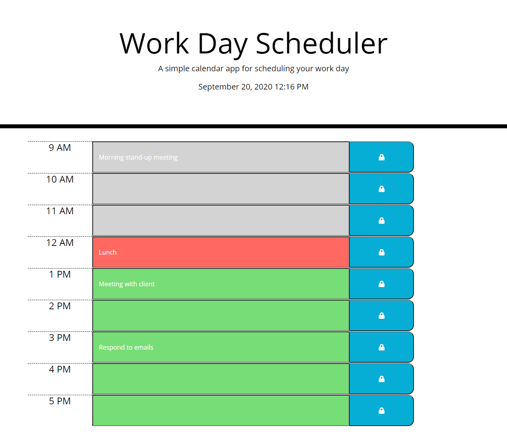

# 🗓  Day Planner

 [CLICK HERE TO VIEW LIVE SITE]( https://kristykeller.github.io/DayPlanner/)

## User Story
```
As an employee with a busy schedule
I want to add important events to a daily planner
So that I can manage my time effectively

```

## Application Description
Work day planner developed to create a schedule based on standard business hours where the current date and time is displayed. Timeblocks are color coded to indicate whether the event is in the past, present, or future. The user's entered schedule is saved in local storage and stored when the page is refreshed. 

## Demo


## Screenshot


## Built With
* Moment.js
* Bootstrap 
* JavaScript
* HTML
* CSS

## License
[](https://opensource.org/licenses/MIT)

Copyright 2020 ©Kristy Keller

<sup>Permission is hereby granted, free of charge, to any person obtaining a copy of this software and associated documentation files (the "Software"), to deal in the Software without restriction, including without limitation the rights to use, copy, modify, merge, publish, distribute, sublicense, and/or sell copies of the Software, and to permit persons to whom the Software is furnished to do so, subject to the following conditions:
  
<sup>The above copyright notice and this permission notice shall be included in all copies or substantial portions of the Software.

<sup>THE SOFTWARE IS PROVIDED "AS IS", WITHOUT WARRANTY OF ANY KIND, EXPRESS OR IMPLIED, INCLUDING BUT NOT LIMITED TO THE WARRANTIES OF MERCHANTABILITY, FITNESS FOR A PARTICULAR PURPOSE AND NONINFRINGEMENT. IN NO EVENT SHALL THE AUTHORS OR COPYRIGHT HOLDERS BE LIABLE FOR ANY CLAIM, DAMAGES OR OTHER LIABILITY, WHETHER IN AN ACTION OF CONTRACT, TORT OR OTHERWISE, ARISING FROM, OUT OF OR IN CONNECTION WITH THE SOFTWARE OR THE USE OR OTHER DEALINGS IN THE SOFTWARE.
  
## Questions

If you have any questions regarding this repo, please contact me at the following:

* <keller.kristy@outlook.com>

* [KristyKeller](https://github.com/KristyKeller)
